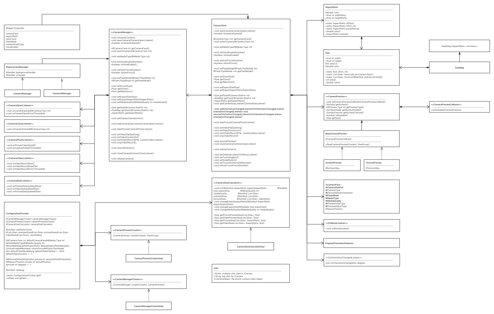

<h1 align="center">iCamera: 功能丰富、高度可定制的 Android 相机库</h1>

<p align="center">
  <a href="http://www.apache.org/licenses/LICENSE-2.0">
    
  </a>
  <a href="https://bintray.com/beta/#/easymark/Android/icamera?tab=overview">
    
  </a>
  <a href="https://www.codacy.com/manual/Shouheng88/iCamera?utm_source=github.com&amp;utm_medium=referral&amp;utm_content=Shouheng88/iCamera&amp;utm_campaign=Badge_Grade">
    
  </a>
  <a href="https://travis-ci.org/Shouheng88/iCamera">
    
  </a>
    <a href="https://developer.android.com/about/versions/android-4.0.html">
    
  </a>
   <a href="https://github.com/Shouheng88">
    
  </a>
  <a target="_blank" href="https://shang.qq.com/wpa/qunwpa?idkey=2711a5fa2e3ecfbaae34bd2cf2c98a5b25dd7d5cc56a3928abee84ae7a984253">
    
  </a>
</P>

## 1、相机库简介

该相机库功能全面，支持拍照或者视频录制所需的全部基础功能；此外，该相机库提供了可供用户进行定制的接口，你可以根据自己的需求对其中的算法和策略进行个性化定制。

**相机目前支持的功能**：

- 拍摄照片：屏幕旋转、图片旋转处理以及其它所需的各种基础功能
- 录制视频：屏幕旋转、视频旋转处理以及其它所需的各种基础功能
- 整合了 Camera1 和 Camera2，暴露了接口，支持用户自定义
- 整合了 TextureView 和 SurfaceView，暴露了接口，支持用户自定义
- 闪光灯
- 对焦
- 支持前置和后置相机
- 快门声
- 支持缩放，支持手势缩放，支持手势缩放自定义
- 支持自定义输出图片宽高比、长度和高度，内置两种算法，暴露了接口，支持用户自定义
- 相机图片、视频和预览尺寸发生变化的回调监听
- 获取支持的图片、预览和视频的尺寸信息
- 支持指定输出视频的最大时长和大小
- 支持预览界面手势滑动监听
- 预览自适应和裁剪等，支持多种自适应策略
- 增加相机信息缓存，拒绝多次计算，提高了相机启动速率
- 触摸进行缩放
- 内置传感器监听，解决手机横屏和竖屏拍摄和录制的问题
- 最低 API 支持到 14

如上所述，我们提供了多种可供用户自定义的接口，你可以按照我们指定的接口对相机进行自定义配置。

## 2、使用

### 2.1 引入依赖

该库已经上传到了 jcenter 仓库。你需要在项目的 Gradle 中加入 jcenter 仓库：

```groovy
repositories { jcenter() }
```

然后，在项目依赖中直接引用我们的库即可：

```groovy
implementation 'me.shouheng.icamera:icamera:0.0.1-beta'
```

### 2.2 使用相机控件

直接在布局文件中使用 CameraView 控件即可，

```xml
    <me.shouheng.icamera.CameraView
            android:id="@+id/cv"
            app:scaleRate="10"
            app:mediaType="picture"
            app:cameraFace="rear"
            android:adjustViewBounds="true"
            app:clipScreen="false"
            app:aspectRatio="4:3"
            app:cameraAdjustType="heightFirst"
            android:layout_centerInParent="true"
            android:layout_width="match_parent"
            android:layout_height="wrap_content"/>
```

### 2.3 配置

**1. 通过 CameraView 进行配置**

CameraView 控件本身提供了一些实例方法，你可以通过这些实例方法对 CameraView 进行配置。

**2. 通过 ConfigurationProvider 进行配置**

除了使用 CameraView 的实例方法，你还可以使用 ConfigurationProvider 的方法进行配置。ConfigurationProvider 是一个单例类，通过 `ConfigurationProvider.get()` 方法可以获取到其单例。ConfigurationProvider 用来对相机数据进行缓存，比如为了避免多次从系统相机中读取相机属性（比较耗时），我们将计算的结果缓存到了这个单例类中来复用。此外，这个单例类还可以实现对系统相机参数的 “预加载”，你可以在进入相机之前提前计算相应的参数从而加快相机启动的速度。

**3. 个性化定制相机策略**

如上所述，我们暴露了一些接口来帮助你对相机策略进行自定义。比如，虽然官方在 API 21 上面开始支持 Camera2，但实际上很多手机对 Camera2 的支持并不好。根据默认的策略，如果 API >= 21 并且手机支持 Camera2，此时 iCamera 会使用 Camera2，而你可以通过 CameraManagerCreator 改变这个默认策略以使用 Camera1. 首先，自定义 CameraManagerCreator 的实现：

```kotlin
class Camera1OnlyCreator : CameraManagerCreator {
    override fun create(context: Context?, cameraPreview: CameraPreview?) = Camera1Manager(cameraPreview)
}
```

然后，将其设置到 CameraManagerCreator 即可：

```kotlin
ConfigurationProvider.get().cameraManagerCreator = Camera1OnlyCreator()
```

同样的，你可以指定相机默认使用 TextureView 还是 SurfaceView 来展示相机的预览效果。

**4. 个性化定制相机输出尺寸算法**

与 CameraManagerCreator 类似，你可以通过自定义 CameraSizeCalculator 的实现来指定相机的输出尺寸。默认的策略计算策略有两种：

1. 第一种适用于输出的图片或者视频的尺寸，我们会整合期望的输出的尺寸、期望的输出的宽高比和期望的输出的图片质量来选择一个最符合要求的输出尺寸：首先寻找最接近期望的宽高比，然后寻找最接近的尺寸，如果没有指定期望的尺寸会根据期望的输出的质量将所有支持尺寸划分为不同的品质之后选择符合要求的尺寸。

2. 第二种算法适用于预览的尺寸。相比于输出的图片和视频的尺寸，预览的尺寸可能没那么重要。我们只需要寻找一个符合接近于输出的图片或者视频的尺寸的尺寸即可。因此，这里的算法是，首先匹配宽高比，其次匹配尺寸。

上面是我们预定义的两种算法，并且在 CameraSizeCalculator 的默认实现中实现了对计算结果的缓存，在新版本的库中又实现了 Camera1 和 Camera2 的缓存的隔离。你可以通过实现 CameraSizeCalculator 接口，然后将自己的计算策略赋值到 ConfigurationProvider 来实现自己的算法。

## 3、关于

### 3.1 关于项目

**相机库的整体架构设计**：

[](https://www.processon.com/view/link/5c976af8e4b0d1a5b10a4049)

- [作者翻译的 Camera2 文档](https://github.com/Shouheng88/Android-notes/blob/master/%E6%80%A7%E8%83%BD%E4%BC%98%E5%8C%96/Android%E7%9B%B8%E6%9C%BACamera2%E8%B5%84%E6%96%99.md)

- [更新日志](CHANGELOG.md)

### 3.2 关于作者

你可以通过访问下面的链接来获取作者的信息或者关注公众号「Hello 开发者」：

1. Github: https://github.com/Shouheng88
2. 掘金：https://juejin.im/user/585555e11b69e6006c907a2a
3. CSDN：https://blog.csdn.net/github_35186068
4. 简书：https://www.jianshu.com/u/e1ad842673e2

## 4、捐赠项目

我们致力于为广大开发者和个人开发者提供快速开发应用的解决方案。您可以通过下面的渠道来支持我们的项目，

<div style="display:flex;" id="target">


</div>

## License

```
Copyright (c) 2019-2020 Shouheng Wang.

Licensed under the Apache License, Version 2.0 (the "License");
you may not use this file except in compliance with the License.
You may obtain a copy of the License at

   http://www.apache.org/licenses/LICENSE-2.0

Unless required by applicable law or agreed to in writing, software
distributed under the License is distributed on an "AS IS" BASIS,
WITHOUT WARRANTIES OR CONDITIONS OF ANY KIND, either express or implied.
See the License for the specific language governing permissions and
limitations under the License.
```